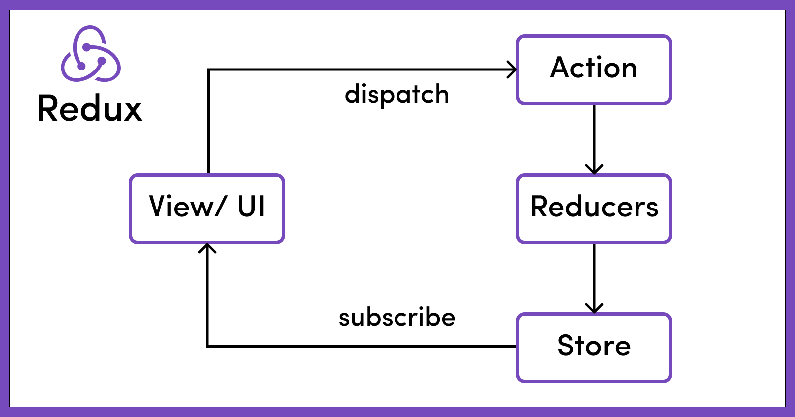

# NgRx Training
NgRx Store provides reactive state management for Angular apps inspired by Redux



## When Should I Use NgRx Store for State Management?
In particular, you might use NgRx when you build an application with a lot of user interactions and multiple data sources, or when managing state in services are no longer sufficient.

### A good guideline that might help answer the question, "Do I need NgRx Store?" is the SHARI principle:

1. **S**hared: state that is accessed by many components and services.
2. **H**ydrated: state that is persisted and rehydrated from external storage.
3. **A**vailable: state that needs to be available when re-entering routes.
4. **R**etrieved: state that must be retrieved with a side-effect.
5. **I**mpacted: state that is impacted by actions from other sources.

### What kind of problems does NgRx solve?
- handling user interactions
- debugging
- performance
- avoiding race conditions

### What DON'T needs to be in the Store?
- unshared state (single component usage)
- angular form state
- non serializable state (route state)

## Main building blocks of NgRx
- Store
- Actions
- Reducers
- Selectors
- Effects

### Actions
Actions are one of the main building blocks in NgRx. Actions express unique events that happen throughout your application. From user interaction with the page, external interaction through network requests, and direct interaction with device APIs, these and more events are described with actions.

```javascript
import { createAction, props } from '@ngrx/store';

export const login = createAction(
  '[Login Page] Login',
  props<{ username: string; password: string }>()
);
```

### Reducers
Reducers in NgRx are responsible for handling transitions from one state to the next state in your application. Reducer functions handle these transitions by determining which actions to handle based on the action's type.

```javascript
export const initialState: State = {
    home: 0,
    away: 0,
};

export const scoreboardReducer = createReducer(
  initialState,
  on(ScoreboardPageActions.homeScore, state => ({ ...state, home: state.home + 1 })),
  on(ScoreboardPageActions.awayScore, state => ({ ...state, away: state.away + 1 })),
  on(ScoreboardPageActions.resetScore, state => ({ home: 0, away: 0 })),
  on(ScoreboardPageActions.setScores, (state, { game }) => ({ home: game.home, away: game.away }))
);
```

### Selectors
Selectors are pure functions used for obtaining slices of store state. @ngrx/store provides a few helper functions for optimizing this selection. Selectors provide many features when selecting slices of state:
- Portability
- Memoization
- Composition
- Testability
- Type Safety

```javascript
import { createSelector } from '@ngrx/store';
 
export interface FeatureState {
  counter: number;
}
 
export interface AppState {
  feature: FeatureState;
}
 
export const selectFeature = (state: AppState) => state.feature;
 
export const selectFeatureCount = createSelector(
  selectFeature,
  (state: FeatureState) => state.counter
);
```

### @ngrx/effects
Effects are an RxJS powered side effect model for Store. Effects use streams to provide new sources of actions to reduce state based on external interactions such as network requests, web socket messages and time-based events.

```javascript
import { Injectable } from '@angular/core';
import { Actions, createEffect, ofType } from '@ngrx/effects';
import { EMPTY } from 'rxjs';
import { map, mergeMap, catchError } from 'rxjs/operators';
import { MoviesService } from './movies.service';
 
@Injectable()
export class MovieEffects {
 
  loadMovies$ = createEffect(() => this.actions$.pipe(
    ofType('[Movies Page] Load Movies'),
    mergeMap(() => this.moviesService.getAll()
      .pipe(
        map(movies => ({ type: '[Movies API] Movies Loaded Success', payload: movies })),
        catchError(() => EMPTY)
      ))
    )
  );
 
  constructor(
    private actions$: Actions,
    private moviesService: MoviesService
  ) {}
}
```

## State management lifecycle


